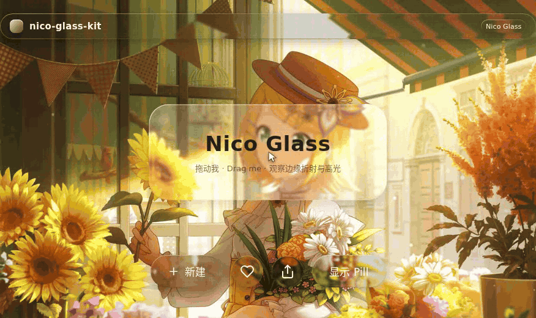
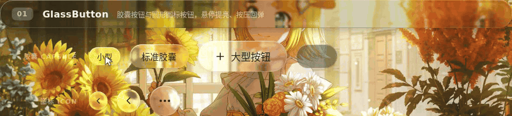
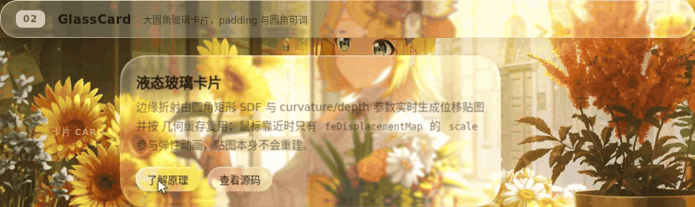
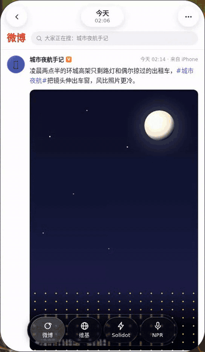
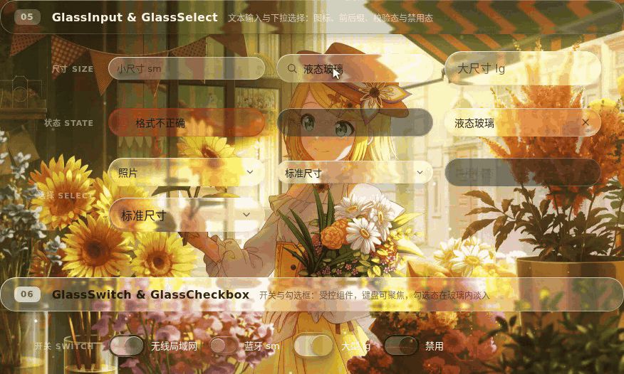
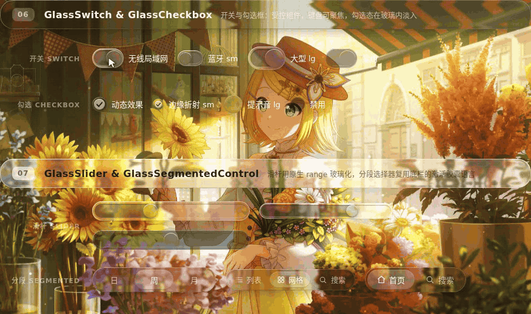
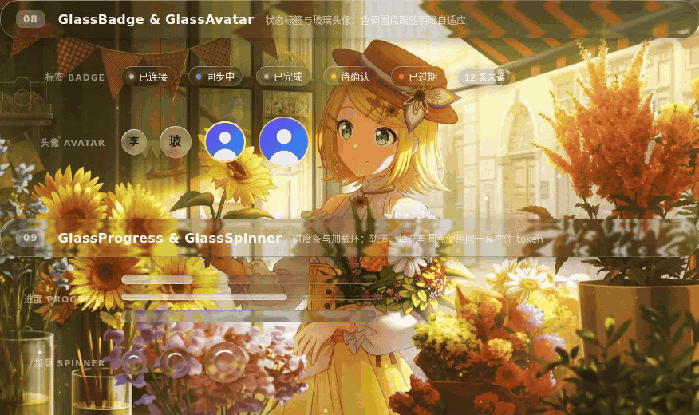
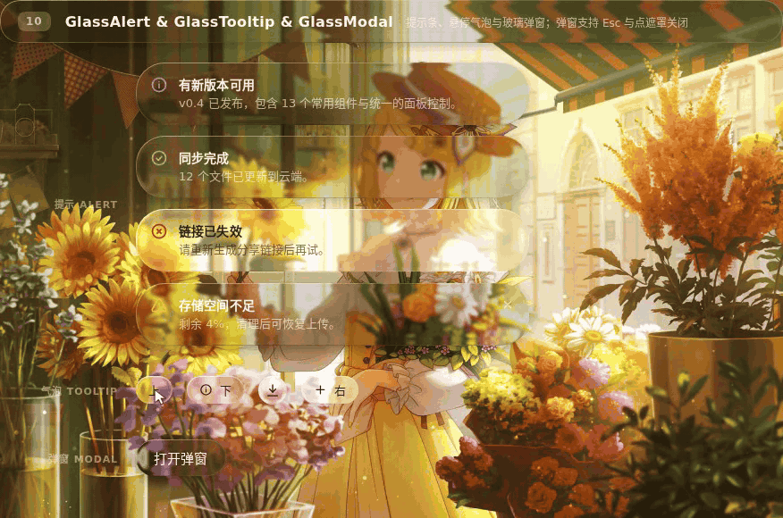

# nico-glass-kit

把苹果风格（iOS 26 质感）的玻璃做成 React 组件——不只是模糊，而是真正的位移折射。

[English](README.md) · MIT · React 18+



## 这是什么

一套小组件库，在浏览器里还原 iOS 26 视觉语言里的磨砂玻璃面板。每个表面都是真的玻璃：`backdrop-filter` 里跑一张 SVG 位移图，背景会沿着面板的圆角被弯折，而不是简单糊掉。材质参数全部可调——模糊、染色、折射深度、倒角剖面、色散——指针靠近时还会触发弹性形变和边缘高光。

整个库刻意做到零运行时依赖：React 是 peer 依赖，其余都是普通的 TS + CSS。

## 特性

- **真折射。** 背景由按圆角半径生成的符号距离场（SDF）贴图做位移，所以边缘像倒角一样弯折；高画质档还带色散（RGB 分离）。
- **分档渲染，自动降级。** 按浏览器实际能力在 `high → medium → low` 之间选择；不支持 `backdrop-filter: url()` 的浏览器拿到的是一套普通 CSS 背景链，而不是坏掉的表面。
- **逐元素明暗自适应。** `overLight="auto"` 采样每个表面下方实际绘制的像素亮度，单独翻转该元素的文字、染色、边缘与阴影，并带迟滞避免来回跳变。
- **`GlassLightGroup`。** 把若干 auto 元素绑成一个识别组，让一整行或整条悬浮栏只做一个明暗判断，而不是逐片闪烁。
- **SSR 安全。** 模块顶层不碰 `window`/`document`；首次客户端渲染固定为 low 档加深色回退，挂载后再升级。
- **18 个成品组件**跑在同一个基元上，接受同一套材质参数。

## 环境要求

- React 18 及以上。
- 折射需要 Chromium 系浏览器。Firefox 与 Safari 会自动落到 low 档（普通 `backdrop-filter` 背景链）。

## 安装

这个包**还没有发布到 npm**，请从仓库安装：

```bash
npm install github:more-nico/nico-glass-kit
```

仓库里有 `prepare` 脚本，安装过程会自动构建 `dist/`，不需要额外步骤。

如果你想改这个库本身，就用源码检出，再让应用指向它（包里只发布 `dist/`）：

```bash
git clone https://github.com/more-nico/nico-glass-kit.git
cd nico-glass-kit
npm install
npm run build
npm install /path/to/nico-glass-kit
```

## 快速开始

```tsx
import { GlassProvider, GlassCard, GlassButton } from 'nico-glass-kit';
import 'nico-glass-kit/style.css';

export function Demo() {
  return (
    <GlassProvider quality="high" overLight="auto">
      <GlassCard cornerRadius={24}>
        <GlassButton>新建项目</GlassButton>
      </GlassCard>
    </GlassProvider>
  );
}
```

`GlassProvider` 负责挂载全局共享的 SVG 滤镜注册表，必须包住所有玻璃组件；样式文件 `nico-glass-kit/style.css`（设计令牌 + 分层样式）也必须引入。

## 渲染分档

| 档位 | 实际渲染什么 |
| --- | --- |
| `low` | 普通 CSS `backdrop-filter` 链（模糊 / 饱和 / 亮度）。也是首次客户端渲染和无法使用 SVG 背景滤镜时的回退。 |
| `medium` | 经 SVG 滤镜图做一次位移。 |
| `high` | 色散：RGB 分离，三次位移；并启用指针弹性与悬停提亮。 |

用 provider 或单个表面上的 `quality` 指定档位，浏览器跑不动时库会沿档位链自动降级。

## 明暗处理

`overLight` 接受 `true`、`false` 或 `'auto'`：

- `'auto'`（默认）采样每个元素下方的背景并逐元素决定明暗，带节流与迟滞。读不出来的背景（跨域 iframe、非 CORS 图片）退回 `prefers-color-scheme`。
- `true` / `false` 固定模式，同时让该元素退出探测。

相邻元素需要保持一致时（一行工具栏、一条底栏、页脚），把它们放进 `GlassLightGroup`，整条一起翻转。

## 组件

| 组件 | 说明 |
| --- | --- |
| [`GlassSurface`](src/core/GlassSurface.tsx) | 基元组件：分层结构、材质、探测与弹性都在这里。 |
| [`GlassProvider`](src/core/GlassProvider.tsx) | 全局默认值 + SVG 滤镜注册表。 |
| [`GlassLightGroup`](src/core/GlassLightGroup.tsx) | 让绑定的多个元素共享一次明暗判断。 |
| [`GlassButton`](src/components/GlassButton.tsx) | 胶囊与圆形图标按钮，悬停提亮、按压回弹。 |
| [`GlassCard`](src/components/GlassCard.tsx) | 大圆角玻璃面板，内容层可独立滚动。 |
| [`GlassNavBar`](src/components/GlassNavBar.tsx) | 悬浮三段式顶栏（左 / 中 / 右）。 |
| [`GlassTabBar`](src/components/GlassTabBar.tsx) | 底栏，带滑动激活胶囊。 |
| [`GlassPill`](src/components/GlassPill.tsx) | 悬浮通知胶囊 / Toast，带进入退出动画。 |
| [`GlassInput`](src/components/GlassInput.tsx) | 文本输入，支持前后缀插槽、尺寸与校验态。 |
| [`GlassSelect`](src/components/GlassSelect.tsx) | 玻璃下拉选择，弹层圆角与动效跟随触发器。 |
| [`GlassSwitch`](src/components/GlassSwitch.tsx) | 开关，状态填充放在内容层。 |
| [`GlassCheckbox`](src/components/GlassCheckbox.tsx) | 勾选框，勾选标记也是玻璃。 |
| [`GlassSlider`](src/components/GlassSlider.tsx) | 用原生 range 玻璃化的滑杆，磨砂内嵌轨道。 |
| [`GlassSegmentedControl`](src/components/GlassSegmentedControl.tsx) | 分段选择器，复用底栏的激活胶囊语言。 |
| [`GlassBadge`](src/components/GlassBadge.tsx) | 带色调圆点的状态标签。 |
| [`GlassAvatar`](src/components/GlassAvatar.tsx) | 玻璃边框内的图片或首字头像。 |
| [`GlassProgress`](src/components/GlassProgress.tsx) | 复用同一套控件轨道的进度条。 |
| [`GlassSpinner`](src/components/GlassSpinner.tsx) | 加载环。 |
| [`GlassAlert`](src/components/GlassAlert.tsx) | 按色调着色的行内提示，可关闭。 |
| [`GlassModal`](src/components/GlassModal.tsx) | 带动画的弹窗面板，Esc 或点遮罩关闭。 |
| [`GlassTooltip`](src/components/GlassTooltip.tsx) | 悬停 / 聚焦气泡，四个方向。 |

### 所有组件共享的参数

| 参数 | 类型 | 默认值 | 说明 |
| --- | --- | --- | --- |
| `quality` | `'low' \| 'medium' \| 'high'` | 取 provider 的值 | 单个表面的档位覆盖，仍会自动降级。 |
| `overLight` | `boolean \| 'auto'` | `'auto'` | 该元素的明暗处理方式。 |
| `optics` | `Partial<GlassOptics>` | — | 稀疏覆盖，合并到下表的默认值之上。 |
| `elasticity` | `number`（0–1） | `0.2` | 指针弹性（high 档）；`0` 为刚性。 |
| `highlightIntensity` | `number` | `1` | 边缘高光强度倍数，高光位置跟随指针。 |
| `hoverBrightnessBoost` | `number` | `0` | 悬停时额外增加的亮度，`GlassButton` 设为 `0.5`。 |
| `cornerRadius` | `number` | `20` | 组件级圆角半径。 |

### 材质参数（optics）

| 键 | 默认值 | 含义 |
| --- | --- | --- |
| `blur` | `3` | 背景模糊半径（px）。 |
| `saturation` | `100` | 饱和度百分比。 |
| `brightness` | `1.1` | 亮度倍数。 |
| `tint` | `light-dark(rgb(255 255 255), rgb(18 20 26))` | 基础染色。 |
| `tintStrength` | `0.2` | 染色强度，0–1。 |
| `refraction` | `1` | 折射强度，映射到位移比例。 |
| `curvature` | `0.2` | 倒角剖面：`0` 为桶形，`1` 为 squircle。 |
| `depth` | `8` | 折射带宽度（px）。 |
| `dispersion` | `0.1` | 色散强度，仅 high 档生效。 |

## Playground

`playground/` 里的演示页把组件放在动态和实拍背景上，右侧面板可以实时调所有材质参数。界面是中文的。

```bash
npm run dev   # http://localhost:5173
```

### 更多演示

**GlassButton** —— 悬停提亮、按压回弹、图标按钮与禁用态。



**GlassCard** —— 指针沿卡片边缘扫过时的边缘高光与弹性位移。



**GlassNavBar 与 GlassTabBar** —— 悬浮顶栏与底栏叠在滚动信息流上，随内容明暗自动翻转。



**GlassInput 与 GlassSelect** —— 输入、清除，以及选项高光跟随指针的玻璃下拉。



**GlassSwitch、GlassCheckbox、GlassSlider、GlassSegmentedControl** —— 选择类控件，所有状态填充都在内容层。



**GlassBadge、GlassAvatar、GlassProgress、GlassSpinner** —— 状态与反馈类元素。



**GlassAlert、GlassTooltip、GlassModal** —— 气泡提示、可关闭的提示条与弹窗。



## 开发

```bash
npm run dev        # playground 开发服务器
npm run typecheck  # tsc --noEmit，覆盖 src/ 与 playground/
npm test           # vitest，node 环境，只测纯函数
npm run build      # 只打包库（dist/），不打包 playground
```

测试跑在 node 环境里，所以只覆盖纯函数——位移贴图编码、滤镜图、材质合并、背景探测调度。需要画布或合成器的部分只能在 playground 里人工验证。

## 说明与限制

- 背景探测是对真实像素的近似：径向渐变取最远角档位，角关键字线性渐变按 45° 对角线近似，`url()` 背景只在 CORS 干净时逐像素采样；读不出来的背景退回 `prefers-color-scheme`。
- `iframe`、`object`、`embed`、`video`、`canvas` 视为不可知的不透明层：命中它们的采样点会被丢弃，而不是相信元素自身的 CSS 背景。
- 含 `url()` 的 `backdrop-filter` 链里其它函数会被浏览器丢弃，所以模糊与饱和度都写在 SVG 图里，CSS 里不写。
- 交给滤镜的位移贴图是刻意降采样的（`lensMapRasterScale`，默认 `0.2`，范围 `0.1`–`0.5`）：折射边缘会稍软一点，换来明显更低的合成准备开销。

## 许可

MIT，见 [package.json](package.json)。

`assets/` 里的演示 GIF 是 playground 的录屏，其中的背景壁纸为演示用途引用的第三方插画，版权归原作者所有，不属于本包的一部分。
