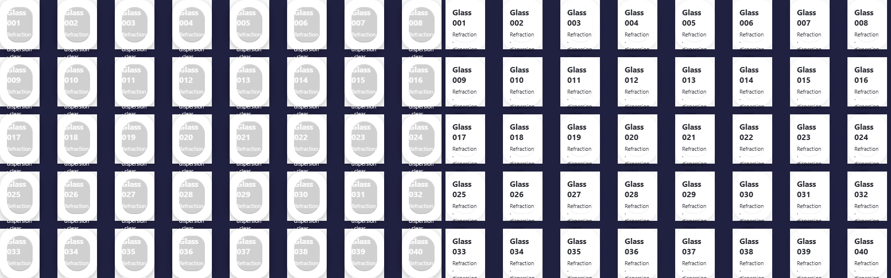

# 提交前代码审查与补充复测

日期：2026-10-06。审查覆盖滤镜引用计数与节点清理、动画回调取消、背景探测续算、DPR / ResizeObserver 订阅、贴图分配保护及图片缓存。修复了一个同时可见图片超过缓存容量时的功能与性能问题。当前源码通过全部检查；历史 [第一轮](report.md) 和 [第二轮](report-round2.md) 证据保持原样。

## 审查发现与修复

32 条图片 LRU 在同时可见 **40 张不同背景图片** 时，会淘汰下一次探测仍需要的图片。图片加载通知又触发所有表面探测，形成反复解码循环，明暗模式无法收敛。

修复在每个绘制节点的 WeakMap 中保留最多 64 个**精确采样颜色**，缓存键包含图片 URL、尺寸及采样坐标；不保留额外图片缓冲。图片完成解码时先填充已请求的采样点，再进入有界图片 LRU。后续读取这些颜色不会再次解码被淘汰的图片。尺寸 / 位置变化仍重新精确采样。

私有图片解码采用四并发队列，取消已替换图片的请求，并清理移除节点的任务。有等待任务时每 250ms 检查一次过期请求，空队列不轮询。解码完成和失败均清除事件处理器。新增浏览器回归覆盖 40 张同时可见图片、稳定后的解码次数、cover 尺寸变化的点采样，以及网络加载卡住时的卸载清理。

两个生产构建、相同 1440×900 / DPR 1、40 个 high 表面、40 张 32×32 白底 SVG，连续记录四次一秒间隔快照，无 page error：

| 指标 | 第二轮冻结版 | 审查修复后 |
|---|---:|---:|
| 一秒时累计创建的私有 Image | 324 | 40 |
| 四秒时累计创建的私有 Image | 1299 | 40 |
| 四秒时正确使用浅底模式的表面 | 0 / 40 | 40 / 40 |

这是解码 / 正确性计数，不是 FPS 或浏览器全部图片资源数。[原始数据](evidence-review/image-working-set.json)。以下左为冻结版，右为修复版；白背景现在正确使用浅底模式和深色文字，视觉变化来自明暗误判修复。



## 版本与测试条件

- 基线为 [第二轮冻结构建](evidence-round2/build/)，JS SHA-256 `fab08d806092ae32a4eed70905023ba8a799576e3cf93e9ee77bfda698c41460`。
- 当前源码对应 [审查后冻结构建](evidence-review/build/)，JS SHA-256 `b93c3d1dcee8e136532c379c95caee3e7bc4ae1171a634f43bf2072e6e6af21f`；两版 CSS 相同。
- Chromium 153.0.8010.12、Windows、Core Ultra 5 245KF / 14 逻辑核、NVIDIA / ANGLE D3D11、headless。同浏览器交替两版，每轮交换顺序；每场景三次，预热 2.5 秒和同负载 1 秒，采样 5 秒。三个关键场景共 **18 个无错误样本**。
- 常规 1440×900 / DPR 2 / 贴图倍率 0.2；4K 为 3840×2160 / DPR 1 / 倍率 0.5；CPU 压力为相同密集场景、CDP 6 倍降速。保留 high、默认 optics、弹性、全部九点采样。

本次静态 rAF 频率约 121，第二轮实验约 60；此处只比较本次同条件样本，不把两轮的绝对 FPS 拼接。完整原始帧间隔、CPU / GPU / 内存数据见 [基线](evidence-review/previous.json)、[当前版](evidence-review/optimized.json)、[汇总](evidence-review/summary.json)。以下均为三次中位数，指标定义与限制沿用 [Benchmark 协议](README.md)。

| 场景 | FPS 前 → 后 | p95 ms | p99 ms | 页面主线程忙碌 % |
|---|---:|---:|---:|---:|
| 静态 25 | 121.7 → 120.3 | 13.8 → 13.8 | 14.0 → 14.0 | 1.8 → 1.7 |
| 4K / 倍率 0.5 / 25 | 41.8 → 41.6 | 28.1 → 28.1 | 28.2 → 28.3 | 15.8 → 16.1 |
| CPU 6x / 密集 100 | 43.7 → 43.8 | 34.7 → 28.2 | 35.1 → 34.9 | 99.3 → 98.9 |

| 场景 | 浏览器 CPU / 整机 % | 最忙 GPU 引擎 % | Working set MiB | 专用显存 MiB | JS heap MiB |
|---|---:|---:|---:|---:|---:|
| 静态 25 | 0.44 → 0.49 | 0 → 0 | 618.3 → 617.2 | 85.7 → 93.0 | 7.2 → 6.2 |
| 4K / 25 | 12.08 → 12.24 | 12 → 12 | 616.0 → 616.2 | 212.6 → 212.6 | 5.1 → 5.6 |
| CPU 6x / 100 | 16.59 → 16.12 | 9 → 8 | 624.9 → 625.1 | 90.7 → 91.1 | 6.8 → 5.7 |

没有宣称此修复提高上述场景 FPS；本次变化主要消除图片工作集的反馈循环。CPU 场景逐次范围为基线 43.7–50.5、当前版 43.4–50.5 FPS；单次 p95 的改善不代表稳定吞吐量提升。内存 / 驱动池快照包含波动。

## 视觉、内存与兼容性

静态、4K、CPU 6x，以及稳定悬停、分组悬停、字形和密集场景截图均 **0 个 RGB 像素变化**。medium 稳定状态有 **118 / 5,184,000 个像素**变化，最大通道差 **1**，未见明显视觉差异。保留两张完整 medium 截图以便核查。[视觉统计](evidence-review/visual-states.json)、[medium 前](evidence-review/medium-before.png)、[medium 后](evidence-review/medium-after.png)。对比图为原始物理像素裁切，左为基线，右为当前版，没有重采样。


相同 40 张 1024×1024 PNG 依次换入、等待加载并强制 GC 的专项中，库持有的私有 Image 数仍为 **12 → 12**，V8 backing storage 为 **8,069,898 → 8,071,006 字节**。少量新增颜色 / 几何数据没有破坏缓存保留边界；这些数字不等于整个浏览器 RAM 或显存。[内存数据](evidence-review/image-retention.json)。

类型检查、**217 个单元测试 / 20 文件**、**11 个真实 Chromium 浏览器测试**、库 ESM / CJS / 声明构建及 playground 生产构建全部通过。48 组矩形与 6 组字形冻结像素 fixture 继续通过，压力位移 hash 仍为 **2320444901**，卸载后滤镜和表面数均为 0。[压力与清理数据](evidence-review/stress.json)。真实 Firefox 155 / WebKit 26.6 保持现有 CSS 回退，字形可读、无 page error；不等同于真实 iOS / macOS 设备实测。[兼容性数据](evidence-review/compatibility.json)。

## 取舍与复跑

折射、色散、模糊、贴图倍率、DPR 和 CSS 合成层未改变。四并发解码会让大量远程图片的首次就绪按队列完成；尺寸变化或采样颜色被淘汰时仍有重新解码成本。颜色缓存增加少量受每节点 64 条限制的元数据；32 条 / 64 MiB 图片预算仍是软保留预算，不能限制浏览器全部资源内存。相对第二轮，库 ESM gzip 约增加 0.48kB；没有新增运行时依赖。原有探测软预算和跨帧明暗延迟仍存在。

运行两份本报告冻结构建，再执行相同脚本即可复核：

```powershell
# 分别在两个终端启动
npx vite preview benchmarks --config benchmarks/vite.config.ts --outDir evidence-round2/build --host 127.0.0.1 --port 4179 --strictPort
npx vite preview benchmarks --config benchmarks/vite.config.ts --outDir evidence-review/build --host 127.0.0.1 --port 4178 --strictPort
# 第三个终端
$env:BENCH_PAIR_URL='http://127.0.0.1:4179'
$env:BENCH_CASES='idle-25,4k-quality-25,cpu6-dense-100'
npm run bench:run -- review-audit
npm run bench:compare -- review-audit-baseline review-audit-optimized review-audit-comparison
node benchmarks/image-working-set.mjs review-audit-images
node benchmarks/image-retention.mjs review-audit-memory
node benchmarks/visual-states.mjs review-audit-visual
npm run test:browser
```

[审查证据 manifest](evidence-review/manifest.json) 保存构建、原始数据和截图 SHA-256。`package-review.mjs` 仅打包本次固定目录并校验被测构建 hash；后续实验应使用新的结果和报告目录。
