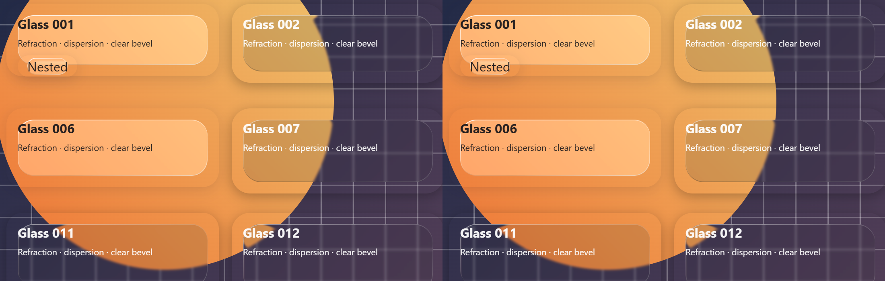
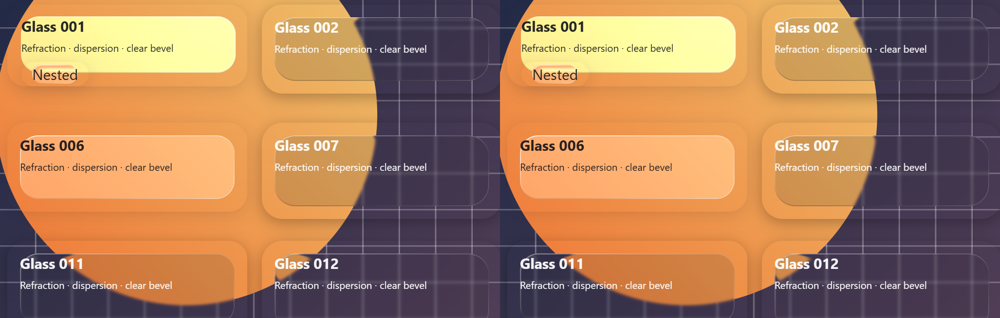
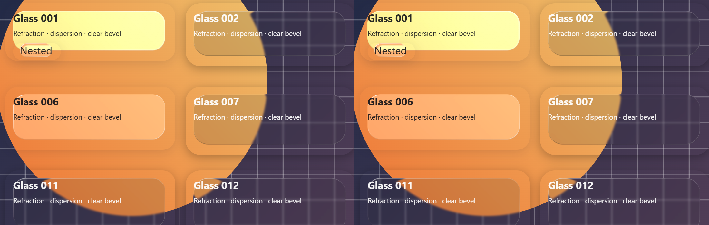
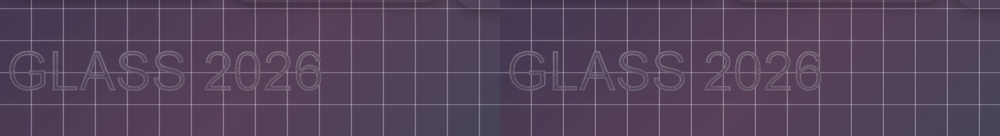
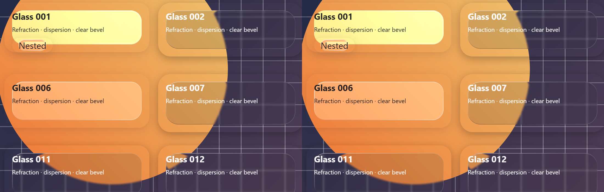
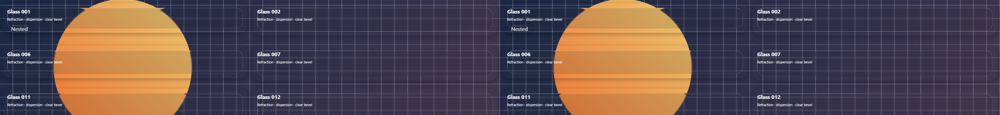

# 第二轮玻璃渲染性能优化

实测日期：**2026-10-06（Asia/Shanghai）**。直接修改 `develop`，以第一轮优化后的冻结构建为本轮基线，重新交替采集两端数据。CPU 6x 密集场景 **36.7 → 52.1 FPS（+41.9%）**，p50 **33.3 → 16.7ms**，p99 **50.1 → 33.5ms**；字形位移计算耗时减少 **23.3%**。4K 和普通设备没有明确的额外帧率收益。

本轮没有改变折射公式、色散、模糊、DPR、贴图倍率、光学参数、弹性参数或 CSS 合成层。没有降低 high 档位或减少 9 点采样。常规、4K、悬停、分组悬停和密集稳定状态截图逐像素一致；字形所在完整场景仅 120 个像素有变化，最大通道差为 2，未见明显视觉变化。

**后续审查说明：** 提交前审查修复了同时可见图片超过 LRU 容量时的解码 / 探测反馈循环。下面的第二轮构建和数据作为历史证据保持原样；当前源码的构建 hash、补充复测和回归检查见 [审查报告](report-review.md)。

## 实际被测版本与条件

- 本轮基线：[第一轮优化构建](evidence/builds/optimized/)，JS SHA-256 `228c4450bbf1c1cc84006a3b706ede3a446357b1dfde695b2b30566d7c8605ff`。
- 本轮最终版：[冻结构建](evidence-round2/build/)，JS SHA-256 `fab08d806092ae32a4eed70905023ba8a799576e3cf93e9ee77bfda698c41460`。该轮测试结束时重新构建的源码 hash 相同。两版 CSS 字节完全相同。
- 源码基提交 `79b42b52d807ff4b70d712d01c3f83956e40da8f`，最终修改保留在 `develop` 工作区；构建 hash 区分实际运行代码，不能只用这个相同的 Git HEAD 区分版本。
- Windows、Intel Core Ultra 5 245KF、14 逻辑核、31.7 GiB RAM；Chromium **153.0.8010.12**，NVIDIA / ANGLE D3D11，headless 专用浏览器。
- 同一浏览器交替加载两版，每轮交换先后顺序；每场景独立 context，**3 次 × 5 秒**，预热 **2.5 秒 + 同负载 1 秒**。共 **54 个**硬件 GPU 样本，均无 page error。
- 常规 **1440×900 / DPR 2 / 原倍率 0.2**；4K **3840×2160 / DPR 1 / 倍率 0.5**。除 medium 专项外全部 high，默认 optics、弹性 0.2、`overLight='auto'`。100 主网格实际含 121 个表面，250 场景有长页面和往返滚动；分组指针每帧 8 次事件。

当前实验的 rAF 上限约 **60 次/秒**，第一轮历史实验约 160。这里比较的是第一轮构建在**当前条件下重新测试**的数字，不将历史 FPS 拼接成累计提升。JSON 的 UTC 日期可能显示 2026-10-05，与本地 10 月 6 日是同一采样时刻。完整协议见 [README](README.md)。

## 做了哪些进一步优化

| 优化 | 原因与质量保证 |
|---|---|
| 可恢复的 9 点背景探测，按耗时选择整批或分片 | 慢设备不再一次阻塞整个网格。保留全部 9 点、亮度公式、阈值、hysteresis 和分组面积权重；快速任务先检查本轮首点，再整批完成，避免常规设备承担每点计时开销。 |
| 续算摊薄首个 hit-test / 样式刷新；真实绘制变化优先 | 每帧只读一点会重复支付首点成本，导致明暗响应积压。采用普通 6ms、续算最多 16ms、绘制变化最多 32ms 的软时间片。只比较探测本来就读取的颜色 / 图片，不在每次 transform mutation 中额外读取 CSS。颜色 / 图片变化重启陈旧采样；内部 tint 过渡沿原有 260ms settle 路径。 |
| 跨帧刷新 DOM 缓存；取消隐藏、卸载和过期成员任务 | 暂停任务不会复用旧帧 rect / computed color；嵌套批次使用单调版本号。分组成员变更时丢弃旧成员的部分结果，避免异步完成后应用过期状态。 |
| 跳过无绘制的透明包装层 bounds；遇到不透明前景结束搜索 | 减少无用 DOM 读取和被遮住的图片解码。保持原 24 层计数规则；前景不透明时，后方不可读 video / canvas 不再错误地让采样失效。 |
| 弹性、高光和指针读取共享一个原生 rAF | 合并大量回调预约，保留 FIFO、同帧取消和下一帧请求语义。弹簧常数、dt、glint 衰减不变；单个回调异常不会阻止其他表面继续更新。 |
| 字形 EDT 复用顶点 / 边界临时数组；纯 SDF 不计算未使用法线 | 原实现每行 / 列反复分配数组。复用缓冲，不改变数学运算顺序；冻结的 pixels、SDF、ring 和 maxInside 全部一致。 |
| 字形 PNG 双重缓存限制和分配前保护 | 128 条 / 32 MiB 编码数据预算；raw / PNG 缓存键分开，失败编码不缓存。包含边界的距离场超过 4 Mi 物理像素时，在 Canvas / EDT 分配前使用可读文本回退。特别窄的病态输入也受边界像素限制。 |
| 解码图片采用 LRU，释放被淘汰的图片与 pending 回调 | 32 条 / 64 MiB 估算软预算，完整图像和精确点采样保持不变。允许保留一张超预算图片以避免不断重解码；重新访问已淘汰图片会有解码成本。 |

这些改动没有新增运行时依赖。主要代码在 `backdropProbe.ts`、`backdropProbeScheduler.ts`、`animationFrame.ts`、`glyphLensMap.ts` 和 `imageCache.ts`。诊断插桩曾记录 5 秒内 10,341 次 `elementsFromPoint`，其中约 1.81 秒在该原生调用中；它用于定位瓶颈，**不是未插桩性能对比数据**。[诊断计数](evidence-round2/diagnostic-probes.json)、[CPU profile 摘要](evidence-round2/diagnostic-profile.json)。

## 相同条件性能对比

以下为各 3 次样本的中位数，均为「第一轮优化版 → 本轮最终版」。FPS 为 rAF callback 频率，帧耗时为 callback 间隔，包含排队等待，不是 GPU 内核耗时或物理屏幕呈现帧率。

| 场景 | FPS | p50 ms | p95 ms | p99 ms | 页面主线程忙碌 % | 滤镜就绪 ms* |
|---|---:|---:|---:|---:|---:|---:|
| 静态 25 | 60.1 → 60.2 | 16.7 → 16.7 | 16.8 → 16.8 | 16.9 → 16.9 | 0.9 → 0.9 | 299 → 287 |
| 动态背景 25 | 60.1 → 60.1 | 16.7 → 16.7 | 16.8 → 16.8 | 16.8 → 16.8 | 17.7 → 18.8 | 291 → 262 |
| 密集 100 | 60.0 → 60.1 | 16.7 → 16.7 | 16.8 → 16.8 | 16.8 → 16.8 | 38.1 → 38.3 | 301 → 299 |
| 4K / 倍率 0.5 / 25 | 49.8 → 49.8 | 16.7 → 16.7 | 33.4 → 33.4 | 33.4 → 33.4 | 15.8 → 15.6 | 239 → 231 |
| CPU 6x / 密集 100 | **36.7 → 52.1** | **33.3 → 16.7** | 33.5 → 33.4 | **50.1 → 33.5** | 100.2 → 99.4 | 1637 → 1556 |
| 分组指针 100 | 60.0 → 60.0 | 16.7 → 16.7 | 16.8 → 16.8 | 16.8 → 16.8 | 71.0 → 69.4 | 320 → 285 |
| 连续 resize 25 | 60.1 → 60.1 | 16.7 → 16.7 | 16.8 → 16.8 | 16.8 → 16.8 | 28.5 → 28.4 | 278 → 251 |
| 滚动 250 | 60.0 → 60.0 | 16.7 → 16.7 | 16.8 → 16.8 | 16.8 → 16.8 | 45.4 → 45.2 | 392 → 384 |
| medium 100 | 60.0 → 60.0 | 16.7 → 16.7 | 16.8 → 16.8 | 16.8 → 16.8 | 38.2 → 38.5 | 315 → 297 |

\* 导航至顶层滤镜就绪的页面墙钟时间，包含加载 / 轮询，不是精确 React mount 计算时间。原始字段名为 `mountMs`。

CPU 6x 的逐次范围：基线 **36.2–37.2 FPS**，最终 **51.2–52.5 FPS**。平均流畅度和 p99 改善，但 p95 几乎不变，主线程仍接近满载，不能宣称消除了所有卡顿或稳定 60 FPS。常规场景大多达到当前刷新上限，不能凭其 FPS 声称 GPU 吞吐量提高；动态 25 主线程比例反而略增，保留在表中。

### CPU、GPU 与内存占用

CPU 为整个专用浏览器进程树累计 CPU 秒 / 墙钟 / 14 核；GPU 为 Windows CIM 最忙单个引擎的百分比。Working set 汇总浏览器 PID，可能重复计入共享页；专用显存含驱动 / 纹理池。Windows 指标取全部有效采样点中位数，JS heap 取各次末尾数据中位数。

| 场景 | 浏览器 CPU / 整机 % | 最忙 GPU 引擎 % | Working set MiB | 专用显存 MiB | JS heap MiB |
|---|---:|---:|---:|---:|---:|
| 静态 25 | 0.2 → 0.3 | 0 → 0 | 613.4 → 619.0 | 86.0 → 120.0 | 6.6 → 5.9 |
| 动态背景 25 | 10.9 → 10.9 | 12 → 12 | 614.9 → 610.8 | 91.1 → 91.5 | 6.0 → 5.4 |
| 密集 100 | 12.1 → 12.1 | 11 → 11 | 624.9 → 631.7 | 94.0 → 82.0 | 5.9 → 7.3 |
| 4K / 25 | 13.4 → 13.4 | 15 → 14 | 637.9 → 643.9 | 212.8 → 212.8 | 6.4 → 4.5 |
| CPU 6x / 100 | 13.6 → 15.6 | 6 → 10 | 629.6 → 625.2 | 90.6 → 89.9 | 6.8 → 6.3 |
| 分组指针 100 | 15.2 → 15.1 | 11 → 11 | 700.1 → 707.1 | 101.8 → 103.0 | 7.4 → 9.9 |
| resize 25 | 11.8 → 11.7 | 12 → 12 | 691.0 → 683.4 | 130.3 → 129.0 | 4.6 → 4.5 |
| 滚动 250 | 13.8 → 13.7 | 12 → 13 | 707.9 → 702.3 | 123.5 → 125.2 | 11.5 → 9.6 |
| medium 100 | 6.6 → 6.8 | 4 → 5 | 625.9 → 626.8 | 79.3 → 78.9 | 5.4 → 6.6 |

CPU 受限场景产生了更多合成帧，浏览器总 CPU 和 GPU 百分比因此上升；没有声称所有占用都下降。普通场景的小幅增减含采样 / GC / 驱动池波动，不能用单个快照证明总内存优化。原始逐次帧间隔、long task、script / layout / style 时间和 Windows 采样见 [基线](evidence-round2/previous.json)、[最终版](evidence-round2/optimized.json)、[汇总](evidence-round2/summary.json)。

### 字形计算与长期图片持有

Node **24.16.0**，同宿主、同合成 coverage、**768×960**、quality 2、edge 8、curvature 0.2、strength 0.4；预热 3 次、采样 8 次。字形位移计算平均 **83.69 → 64.22ms（-23.3%）**，两端 SHA-256 均为 `a0c353da868a45097d6f4ed2c35b566d2eeb9e53b34cd0b98b500e55a8cfbb6c`。这是 CPU 微基准，不代表整帧快 23.3%。6 组优化前冻结 fixture 覆盖 pixels / SDF / ring；48 组矩形位移 SHA 继续通过，最终矩形压力 hash 为 **2320444901**。[字形前](evidence-round2/glyph-before.json)、[字形后](evidence-round2/glyph-after.json)、[矩形压力](evidence-round2/stress.json)。

另一专项在相同浏览器里依次换入 **40 张不同的 1024×1024 PNG 背景**，每张等待私有 Image load，然后强制 GC。通过 CDP 查询库创建的 HTMLImageElement，而非整个浏览器图片资源池：[数据](evidence-round2/image-retention.json)。

| 指标 | 第一轮优化版 | 本轮最终版 |
|---|---:|---:|
| 库持有的私有 Image 对象 | 40 | **12** |
| V8 backing storage | 23.00 MiB | **7.70 MiB** |
| Page errors | 0 | 0 |

持有对象减少 70%，backing storage 减少约 66.5%。它主要反映 V8 管理的外部字符串 / ArrayBuffer 等，**不是总 RAM、实际解码纹理总数或显存下降比例**。预算包括 URL 和自然尺寸 RGBA 的估算；一张超预算图片可以保留，浏览器自己的资源池不受这个 LRU 控制。

相同 100 主网格场景，5 秒 resize、8 轮卸载 / 挂载并 GC 后，两端均为 **29 DOM nodes / 152 原生监听器 / 0 filters / 0 glass surfaces**。backing storage **0.363 → 0.368 MiB**，无新增明显持有问题；矩形缓存仍为 32 条 / 93,584 bytes。[卸载内存数据](evidence-round2/retention.json)。

### 明暗响应的取舍

为了检查帧率收益是否以明显迟滞换取，另在 CPU 6x、100 主网格下：黑色背景预热 2.5 秒，持续 transform 更新，同时改为白色，记录 **35 个可见主表面**的 `data-ngs-light` 变化。两端 3 次交替，初始全部 dark，每次 **35 / 35 完成**，无 page error。[全部逐表面延迟](evidence-round2/light-latency.json)。

| 属性决策延迟，中位数 | 第一轮优化版 | 本轮最终版 |
|---|---:|---:|
| 第一个表面 | 28.3ms | 19.8ms |
| 可见表面的中位完成时间 | 736.8ms | 806.9ms |
| 最后一个表面 | 1716.6ms | 1781.9ms |

最终最后一个表面多约 **65ms（3.8%）**，而非数秒积压。这记录属性决策，后续原有 tint CSS 过渡两端一致。运动探测仍可能跨帧平均不同时间的背景；这里的单次突变结果不保证所有高速 / 无限变化场景都有同样的响应时间。

## 相同场景效果对比

均为 **左：第一轮优化版；右：本轮最终版**。图片来自真实浏览器，以相同物理像素坐标裁切并排复制，未缩放、修图或生成替代效果。[完整常规前](evidence-round2/normal-before.png)、[完整常规后](evidence-round2/normal-after.png)。

| 完整截图场景 | 变化像素 | 最大 RGB 通道差 |
|---|---:|---:|
| 常规、4K、密集稳定、悬停、分组悬停、medium 稳定 | 0 | 0 |
| 字形所在完整场景 | 120 / 5,184,000（0.0023%） | 2 |

字形计算本身通过冻结 SHA，截图差异不能等同位移场变化。人工放大复核未见明显折射 / 色散 / 字形回归；保留 [完整字形场景前](evidence-round2/glyph-scene-before.png)、[后](evidence-round2/glyph-scene-after.png) 和 [全图统计 / 裁切坐标](evidence-round2/visual.json)。主 benchmark 的 CPU6 / group / scroll / medium 即时截图各有 138 个非零像素，最大通道差 1，原始统计仍在 summary 中。

这描述本轮相对第一轮的差异。相对最初 `main` 实现，第一轮 CPU Canvas 编码的极小边缘舍入差异仍存在，详见 [第一轮历史报告](report.md)。

## 低 GPU 与兼容性

同一 Chromium 使用 **SwiftShader**，两端交替，每场景 3 次 / 5 秒，保持相同高质量配置。它是软件合成压力测试，不能等同真实低端手机 GPU。

| 软件 GPU 场景 | FPS 前 → 后 | p95 ms 前 → 后 | 主线程忙碌 % 前 → 后 |
|---|---:|---:|---:|
| 动态背景 25 | 9.1 → 9.1 | 133.3 → 116.8 | 6.0 → 6.1 |
| 4K / 倍率 0.5 / 25 | 4.8 → 4.8 | 216.9 → 216.9 | 3.0 → 3.0 |

12 个样本无 page error，两场景截图 RGB 均零差异，位移 hash 一致，卸载后 filters / surfaces 为 0。没有明显吞吐量收益，软件光栅化仍是瓶颈；动态图的 p95 有改善，但 4K 未改善。[基线](evidence-round2/software-previous.json)、[最终](evidence-round2/software-optimized.json)、[汇总](evidence-round2/software-summary.json)。

真实 **Firefox 155.0**、**WebKit 26.6** 两版均通过：原有 low / CSS fallback 为 `blur(3px) saturate(1) brightness(1.1)`，无 SVG filter，字形就绪，无 page error。[实际引擎结果](evidence-round2/compatibility.json)。没有新增它们对 Chromium SVG backdrop 的支持；WebKit Windows 测试不是 iOS / macOS Safari 实机测试。

最终检查通过 **217 项单元测试、10 项 Chromium 浏览器回归、TypeScript、库 ESM / CJS / d.ts / CSS 和 playground 生产构建**。新增覆盖首点突然变慢、续算摊薄首点、隐藏 / 卸载取消、真实绘制变化、分组成员变更、40 图片循环和 4000px 字号的可读回退。没有改 CSS、降低倍率或修改光学公式。

## 边界与复跑

- 保留高质量原生 SVG backdrop 后，4K / 软件 GPU 仍受浏览器合成限制，无法据本轮结果宣称所有设备达到 60 FPS。
- 6 / 16 / 32ms 是软时间片，不能抢占一次原生调用；真实绘制变化可以用较长时间片换取响应。持续快速运动的明暗判断可能延后 / 时间平均，折射渲染本身保持原频率和配置。
- 原本被不透明前景完全遮住的 video / canvas 导致的错误 fallback 已修正；这类场景的自动明暗可能与旧错误行为不同。
- 超过 4 Mi 物理像素（含边界）的单字形会显示普通可读文本；无效底层距离场输入抛 `RangeError`。这是避免病态分配的实际视觉取舍，普通 4K fixture 未触发。矩形原有 64 Mi 物理像素保护继续生效。
- 图片 LRU 淘汰会带来重解码开销；一张超预算图片保留，因此不是硬内存上限。部分 JS heap / working set 指标略增，不声称总内存或所有 CPU 指标都下降。
- 单机、CPU 降速和 SwiftShader 不替代低端手机实测；未采集逐帧 GPU 内核耗时。保留全部原始数据与实际无改善结果。

按 [复跑说明](README.md) 启动两份冻结构建，即可在相同输入下交替复测。第二轮证据独立保存在 [evidence-round2](evidence-round2/manifest.json)，第一轮 archive 原样保留；完整原始 PNG 和中间实验在本地 gitignored `results/`。manifest 提供 SHA-256、构建身份和物理裁切坐标。
