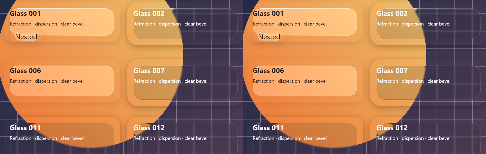
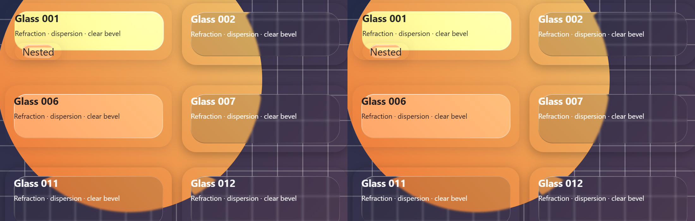
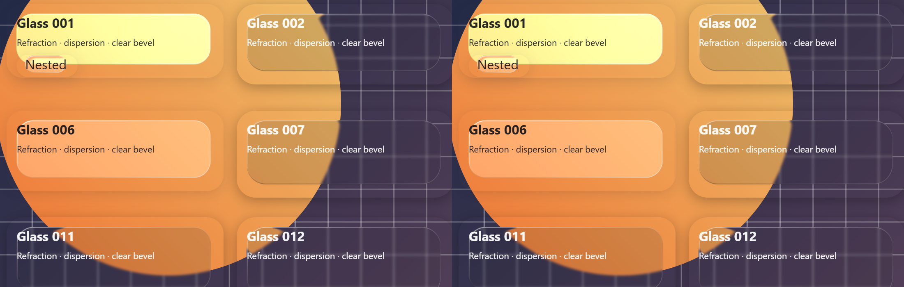
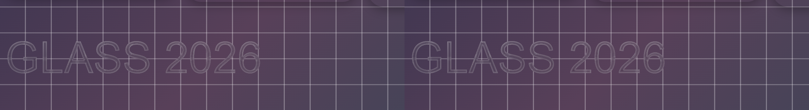
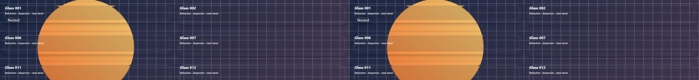

# 玻璃渲染性能优化报告

这是第一轮优化的历史报告。第二轮在该优化版本上继续改进，最新结果见 [第二轮报告](report-round2.md)；本页数据和冻结构建保留原样，不能当作当前源码的复测结果。

整理日期：2026-10-06。主要性能数据标记日期为 2026-10-03，稳定状态视觉复核和 SwiftShader 压力测试标记日期为 2026-10-05。

第一轮已直接在 `develop` 工作目录完成优化。基线为 `79b42b52d807ff4b70d712d01c3f83956e40da8f`；优化版是该提交上的工作区修改。两端实际测试的生产构建均冻结在 [evidence/builds](evidence/builds/)，文件 SHA-256 见 [manifest.json](evidence/manifest.json)。第一轮结束时源码重新构建的 JS 与实测优化版 SHA-256 完全相同：`228c4450bbf1c1cc84006a3b706ede3a446357b1dfde695b2b30566d7c8605ff`。两端 CSS 文件完全相同。

连续尺寸变化场景 FPS 从 **68.7 提升到 87.8（+27.8%）**，p95 帧间隔从 **31.3ms 降到 12.6ms**。滚动场景提升 **13.6%**；6 倍 CPU 降速场景提升 **11.2%**。没有降低贴图倍率、DPR 上限、模糊、色散、折射强度或玻璃质量档位。4K 的提升较小，软件 GPU 的吞吐量没有改善；这些限制保留在结果中。

## 做了哪些优化

| 改动 | 原因与保持视觉的方式 |
|---|---|
| 中性区域用批量填充，只计算边缘 / 圆角位移；复用距离计算 | 大面积内部位移原本就是中性值，避免每个内部像素重复 SDF / 开方。48 组冻结基准逐字节一致，仍生成完整物理分辨率的位移场。 |
| 渲染路径缓存 PNG 和元数据，释放完整 RGBA；32 条 / 32 MiB 双重 LRU 限制 | 组件只需要 PNG，保留每张完整 RGBA 会在 resize / 多尺寸场景积累内存。公共 `generateLensMap()` 仍返回完整像素，统计新增 `bytes`；折射强度仅更新 SVG scale，可重用相同 PNG。失败编码不入缓存，允许重试。 |
| PNG 生成使用 CPU Canvas | `putImageData → drawImage → toDataURL` 每次最终都需要同步读回。CPU Canvas 避免等待 GPU 队列；保留原倍率和 `high` 平滑，允许极小的 Skia 后端舍入差异。 |
| SVG 注册表使用 O(1) 引用计数、批量发布、独立图节点 memo | 引用数变化不需要复制整张 React Map / 更新全部滤镜。最后一个引用释放时同步清理节点索引；顺序 ID 避免原 32 位 key hash 碰撞。无动态折射 / 悬停亮度的 high 表面可共享图，交互表面保持私有。 |
| 合并 ResizeObserver、DPR 和系统色彩模式订阅 | 降低复杂页面监听器数量；DPR 在跨屏 / 缩放且 CSS 尺寸不变时也能更新，原 2x 上限保持不变。 |
| 指针 burst 合并到每帧一次，glint 与弹性共用 bounds；避免相同 DOM 写入 | 8 个甚至更多 pointermove 中只有最后位置能显示，避免重复布局读和 CSS / SVG 属性写入。leave / cancel / 卸载取消待执行工作。 |
| 同一批背景探测共享 DOM 读；惰性读取滚动快照，清理脱离文档的 scroller | 保留全部 9 个采样点，缓存不跨帧，防止读到陈旧颜色；完全节流的 batch 不读取布局，不产生空转 rAF；隐藏页面暂停调度。 |
| 按上次实际探测耗时执行 6ms 帧预算，轮换队列 | 原生 `elementsFromPoint` 是密集场景主要瓶颈。慢设备不继续开启预计超预算的第二个探测，连续背景 mutation 下后面的表面也能获得服务。保持采样准确度，代价是极端情况下明暗适配延迟。 |
| 修复材质替换时旧动画清理写错滤镜；分配前校验尺寸 | DOM setter 绑定其所属 filter ID，旧 spring 清理不会覆盖新材质。非有限输入和超过 `64×1024×1024` 物理像素的单张 map 在分配前拒绝，组件沿现有 CSS 路径回退。 |

没有增加运行时依赖。Playwright / pngjs 仅用于开发测试。CSS 合成层、光学参数和字形折射实现保持现有设置。

## 测试条件

使用同一 Windows 宿主：Intel Core Ultra 5 245KF、14 逻辑核、31.7 GiB RAM；Chromium **153.0.8010.12**，专用 headless 浏览器、GPU 启用，NVIDIA / ANGLE D3D11 后端。完整设备 / 驱动报告保存在原始 JSON 中。

两端使用相同生产 fixture、确定性彩色背景 / 网格 / 字形、独立 browser context、暗色模式；每场景 **3 次**，预热 **2.5 秒 + 相同负载 1 秒**，采样 **5 秒**。常规 viewport **1440×900、DPR 2**；4K 使用 **3840×2160、DPR 1、贴图倍率 0.5**。其余倍率为原默认 **0.2**；除专门的 medium 场景外，全部 high，`overLight='auto'`，默认 optics 和弹性。

主网格数量之外，每 9 个表面增加嵌套玻璃，另有 9 个字形表面；100 网格场景实际 121 个表面。分组指针每帧发出 8 个事件；CPU 压力测试使用 CDP 6x 降速；scroll 测试包含 250 个主表面的长页面。

比较脚本校验场景参数、浏览器版本、GPU 后端、采样时长、次数和宿主 CPU 一致。基线与最终结果各 27 个样本，均无 page error。另用同一浏览器交替加载两版、每轮交换先后次序，复核 CPU 压力结果。

### FPS、帧耗时与页面主线程

下表为 3 次样本中位数，均为「优化前 → 优化后」。p95 是 rAF 帧间隔，不是 GPU 内核耗时；主线程忙碌比例来自 CDP TaskDuration。

| 场景 | FPS | FPS 变化 | p95 帧间隔 ms | 主线程忙碌 % | 首次滤镜就绪 ms* |
|---|---:|---:|---:|---:|---:|
| 静态 25 | 160.0 → 160.0 | +0.0% | 6.4 → 6.4 | 1.8 → 1.7 | 329 → 274 |
| 动态背景 25 | 76.8 → 83.4 | +8.6% | 18.7 → 12.6 | 21.3 → 19.6 | 325 → 277 |
| 密集 100 | 89.4 → 94.7 | +5.9% | 12.6 → 12.6 | 53.7 → 51.1 | 349 → 296 |
| 4K / 倍率 0.5 / 25 | 41.8 → 43.0 | +3.0% | 25.1 → 25.1 | 17.6 → 15.9 | 269 → 228 |
| CPU 6x / 密集 100 | 29.8 → 33.1 | +11.2% | 49.9 → 43.7 | 99.1 → 99.9 | 1742 → 1703 |
| 分组指针 100 | 83.0 → 88.8 | +7.0% | 18.8 → 18.7 | 91.3 → 78.8 | 369 → 303 |
| 连续 resize 25 | 68.7 → 87.8 | +27.8% | 31.3 → 12.6 | 49.5 → 30.6 | 340 → 274 |
| 滚动 250 | 69.7 → 79.1 | +13.6% | 18.8 → 18.7 | 77.0 → 60.6 | 496 → 399 |
| medium 100 | 149.4 → 160.1 | +7.2% | 12.4 → 6.4 | 63.0 → 60.0 | 349 → 290 |

\* 从导航到顶层玻璃滤镜就绪的页面 `performance.now()`，包含加载和轮询，不能当作精确 React mount 耗时。原始数据保留 `mountMs` 名称。

CPU 交替复核：基线 **29.1 FPS**，范围 **29.0–30.3**；优化 **33.1 FPS**，范围 **32.2–33.9**，p95 **50.0 → 43.8ms**。该条件下主线程仍接近 100%，没有达到 60 FPS。[交替基线](evidence/cpu-paired-baseline.json)、[交替优化](evidence/cpu-paired-optimized.json)。

### CPU、GPU 与内存

CPU 是专用浏览器进程树累计 CPU 时间 / 墙钟 / 14 核；GPU 是 Windows CIM 最忙单引擎的占用。working set 是浏览器 PID 总和，含共享页重复计数；显存含纹理池。Windows 数值取采样点中位数，JS heap 取各次最终 CDP 数据中位数。

| 场景 | 浏览器 CPU / 整机 % | 最忙 GPU 引擎 % | Working set MiB | 专用显存 MiB | JS heap MiB |
|---|---:|---:|---:|---:|---:|
| 静态 25 | 0.5 → 0.5 | 0 → 0 | 604.6 → 596.3 | 129.5 → 119.3 | 7.4 → 6.8 |
| 动态背景 25 | 15.0 → 15.0 | 16 → 16 | 631.6 → 623.4 | 108.7 → 104.3 | 4.7 → 5.6 |
| 密集 100 | 17.5 → 18.0 | 16 → 18 | 652.0 → 643.4 | 112.6 → 111.2 | 10.3 → 10.4 |
| 4K / 25 | 12.3 → 12.2 | 12 → 12 | 630.8 → 623.3 | 212.7 → 212.7 | 4.6 → 4.4 |
| CPU 6x / 100 | 14.4 → 14.2 | 6 → 6 | 637.8 → 630.4 | 80.2 → 89.8 | 12.7 → 7.8 |
| 分组指针 100 | 21.8 → 21.5 | 16 → 17 | 738.4 → 720.0 | 106.5 → 105.9 | 7.4 → 7.7 |
| resize 25 | 15.5 → 16.7 | 15 → 18 | 706.0 → 681.3 | 259.1 → 141.1 | 15.3 → 4.7 |
| 滚动 250 | 19.3 → 19.3 | 15 → 16 | 747.3 → 714.8 | 126.6 → 129.6 | 16.6 → 9.7 |
| medium 100 | 13.8 → 13.8 | 11 → 12 | 659.2 → 635.0 | 106.1 → 93.2 | 6.0 → 7.3 |

主线程工作减少不代表全部 CPU / GPU 百分比都下降：更高 FPS 会产生更多合成帧，尤其 resize 的工作量按时间持续发生。JS heap 随 GC 波动，部分场景反而略增；不据此声称所有内存指标都改善。详细逐次帧间隔、long task、script / layout / style 时间及 Windows 采样见 [基线](evidence/baseline.json)、[优化](evidence/optimized.json)、[汇总](evidence/summary.json)。

### 位移计算与持续内存

8 张不同宽度的 1920×1080、DPR 2 完整 map：平均计算耗时 **55.44 → 11.63ms（减少 79.0%）**，两版最终 FNV hash 均为 **2320444901**。这是位移场 CPU 微基准，不代表整帧加速 79%。[基线微基准](evidence/baseline-stress.json)、[优化微基准](evidence/optimized-stress.json)。

另在同浏览器、100 网格 / 121 表面下强制 GC；进行 5 秒 resize、8 轮卸载 / 挂载后再强制 GC：[原始内存数据](evidence/retention.json)。

| 指标 | 优化前 | 优化后 |
|---|---:|---:|
| 挂载时 V8 backing storage | 8.60 MiB | 0.35 MiB |
| resize / churn 后卸载的 backing storage | 12.47 MiB | 0.36 MiB |
| 挂载时原生事件监听器 | 668 | 522 |
| 卸载后 SVG filters / glass surfaces | 0 / 0 | 0 / 0 |
| 卸载后 DOM nodes / 事件监听器 | 29 / 152 | 29 / 152 |
| 优化后缓存保留 | — | 32 条、93,584 bytes |

backing storage 包括 V8 管理的 ArrayBuffer / 外部字符串等，不是浏览器总 RAM。缓存会按设计保留可重用 PNG；其 32 MiB 预算也不是整个页面的内存上限。更高帧率的 resize 会遍历更多中间尺寸，故两版缓存 miss 数不同，最终保留预算与节点清理均正常。

## 相同场景效果对比

下图均 **左：优化前；右：优化后**。从原始浏览器截图按相同物理坐标裁切、并排复制；未缩放、修图或重新生成效果。完整常规截图：[优化前](evidence/normal-before.png)、[优化后](evidence/normal-after.png)。

常规 high、DPR 2，包含嵌套玻璃：

100 网格密集场景、等待光照过渡结束：

悬停亮度 / 高光与分组弹性：

字形玻璃：

4K、原有最高贴图倍率 0.5：

### 差异检查

完整 RGBA 位移计算通过 **48 组优化前 SHA-256**，涵盖奇数尺寸、1px、不同 DPR、圆角截断、宽折射带和曲率；不是用优化后的实现生成期望值。保留折射方向、幅度、RGB 色散、模糊、图层和光学公式。

最终浏览器截图并非逐像素零差异：CPU / GPU Canvas 平滑后端存在舍入区别，主要在玻璃折射边缘。稳定状态完整截图的差异统计如下，RGB 单通道范围为 0–255：[完整统计](evidence/visual.json)。

| 场景 | 有变化的像素比例 | 最大通道差值 | 全图平均绝对通道差值 |
|---|---:|---:|---:|
| 常规 / 字形所在完整场景 | 0.2451% | 17 | 0.002354 |
| 密集稳定状态 | 0.2499% | 17 | 0.002473 |
| 悬停 | 0.2462% | 21 | 0.002761 |
| 分组悬停 | 0.2396% | 24 | 0.002624 |
| 4K | 0.0376% | 14 | 0.000765 |

人工放大检查未见明显折射、文字、色散或层次变化。[常规差异图（RGB 放大 8 倍）](evidence/normal-diff-8x.png)。

主 benchmark 的密集截图在 `pose()` 后立即拍摄，记录了 **16.6423%** 非零差异，其中 **96.94%** 的变化只有 1 个色阶，平均差值 **0.067534**。新增复核两端都在相同固定背景相位再等 **1.5 秒**，差异为上表的 **0.2499%**。原始即时结果仍保留在汇总中；过渡 / 调度时序可以影响截图，不把它隐藏为“完全相同”。

## 低 GPU、兼容性与功能回归

另用 **SwiftShader** 软件 GPU，在同一浏览器交替运行两端、相同 3 次 / 5 秒 / 预热 / viewport / 光学配置。它模拟 GPU 极弱的压力路径，不能等同于真实移动 GPU。

| 软件 GPU 场景 | FPS 前 → 后 | p95 ms 前 → 后 | 页面主线程忙碌 % 前 → 后 |
|---|---:|---:|---:|
| 动态背景 25 | 9.0 → 9.0 | 132.0 → 125.1 | 7.8 → 5.6 |
| 4K / 倍率 0.5 / 25 | 4.9 → 4.7 | 219.1 → 222.2 | 3.6 → 2.8 |

两端均无 page error，位移 hash 一致，卸载后滤镜 / 表面为 0。软件 GPU 的 4K 中位 FPS 小幅下降约 **3.7%**，三次样本范围基线 **4.74–4.92**、优化 **4.58–4.76**，不能声称提升。在保留同等高质量 SVG backdrop 合成时，CPU 工作减少没有解除软件合成瓶颈。[软件 GPU 基线](evidence/software-baseline.json)、[优化](evidence/software-optimized.json)。

最终验证已通过：**198 项单元测试、6 项真实 Chromium 浏览器回归、TypeScript 检查、库 ESM / CJS / d.ts / CSS 构建、playground 生产构建**。覆盖 StrictMode、共享 / 私有滤镜、卸载清理、点击、悬停亮度、高光 / 弹性、连续尺寸变化、材质 scale 更换、DPR、自动明暗、字形和 Canvas 失败回退。

真实 **Firefox 155.0** 与 **WebKit 26.6** 两端验证通过：原有 low / CSS fallback 路径一致，`blur(3px) saturate(1) brightness(1.1)`，无 SVG filters，字形正常，无 page error。[兼容性结果](evidence/compatibility.json)。这不新增它们对 Chromium SVG backdrop 折射的支持，也不代表 macOS / iOS Safari 或所有低端手机已经实机测试。

## Trade-off 与实际边界

- CPU Canvas 保留质量配置，但导致上述极小像素差异，不能保证最终合成图逐像素完全一致。
- 指针事件每帧使用最新位置；超高频事件不会每次立即写入 DOM。极端负载下自动明暗适配可能延后。6ms 探测预算无法抢占单次原生 hit-test，所以仍可能偶尔超时；折射渲染本身不被降档或降低更新频率。
- 过大 / 非有限尺寸改为分配前失败，组件安全回退 CSS。公共底层生成函数对这些输入会抛 `RangeError`。64 Mi 像素阈值限制病态输入，对本次高分辨率测试没有影响。
- 4K 高质量 FPS 提升仅 3%，可能包含环境波动；低 CPU 仍约 33 FPS，软件 GPU 4K 仍约 5 FPS。浏览器 SVG backdrop 合成和原生命中测试仍是剩余瓶颈。
- rAF 频率不等同物理屏幕呈现帧率；GPU 使用率不是总 GPU 百分比，也未采集逐帧 GPU 内核耗时。单机 / 3 次样本不是跨设备统计结论。更完整的方法与指标定义见 [复跑说明](README.md)。

复跑时优先使用保存的两份生产构建，避免重新编译污染历史基线。全部原始 PNG / 中间数据在本地 gitignored `results/`；关键可审查证据、冻结构建和校验和已随本目录保留。
